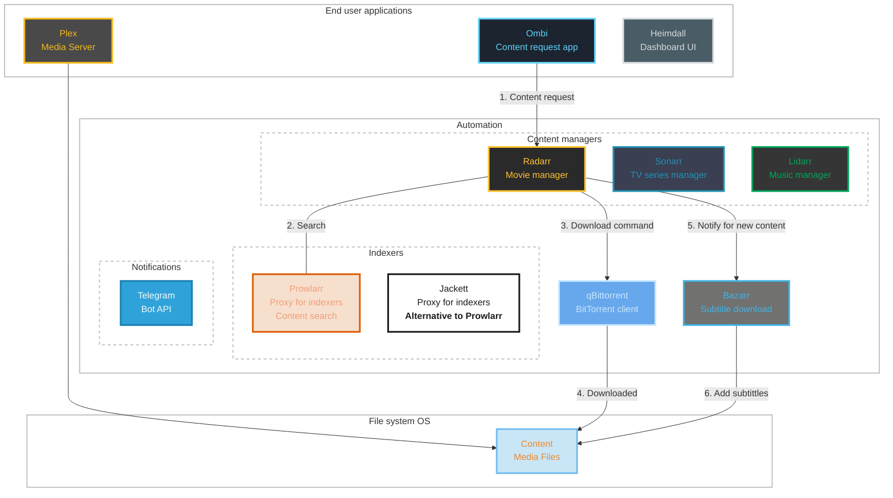
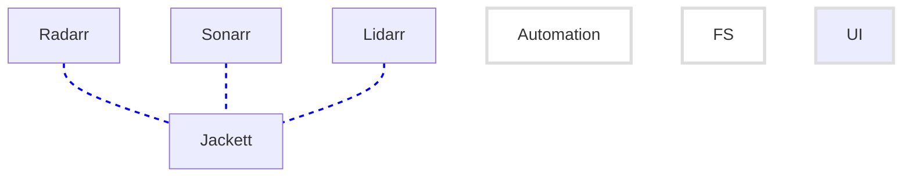

# Lets make a media server
<!-- Home Media Server (Fully Automated) -->

<!-- *Created 2023-01-16* Date started to develop and research-->
*Modified 2023-01-30*


- [Lets make a media server](#lets-make-a-media-server)
  - [The user journey](#the-user-journey)
  - [Architecture](#architecture)
  - [Deployment](#deployment)
  - [Configurations](#configurations)
    - [Plex](#plex)
    - [Heimdall](#heimdall)
    - [qBittorrent](#qbittorrent)
    - [Prowlarr](#prowlarr)
    - [Jacket](#jacket)
    - [Radarr](#radarr)
    - [Sonarr](#sonarr)
    - [Lidarr](#lidarr)
    - [Bazarr](#bazarr)
    - [Ombi](#ombi)
  - [Author notes](#author-notes)
  - [QnA, Improvments. etc..](#qna-improvments-etc)
  - [Refrances](#refrances)

There are a variety of options for creating a media server.<br>
One popular option is to use Plex, which is a free, open-source media server software that can organize and stream your personal media collection.<br>
Another option is Kodi, which is also a free, open-source media center software.<br>
These are just a few examples, and the specific solution that is best for you will depend on your specific needs and technical expertise.

## The user journey

1. The user discovers a new movie, TV show, or music album that they would like to watch/listen to.
2. The user opens the Ombi web interface and requests the movie, TV show, or music album to be added to the library.
3. Ombi sends the request to the appropriate service (Radarr, Sonarr, or Lidarr) depending on the type of media requested.
4. The service (Radarr, Sonarr, or Lidarr) will automatically search for the movie, music, or series on the internet using the configured indexers and torrent trackers (via Jackett/Prowlarr).<br>
   Once the requested media is found, Radarr, Sonarr, or Lidarr will send a command to qbittorrent to download the file.
1. qBittorrent downloads the media file from the internet and places it in the 'Media' folder.<br>
   Once the download is complete, file will be move to the appropriate folder, where it will be picked up by Plex and added to the library.
2. Bazarr is connected to content managers and periodicaly check for new content is added.<br>
   Automatically downloads subtitles for the media file and places them in the same folder as the media file.
3. The media file and its subtitles are now available in the Plex library and can be streamed by the user.<br>
   The user can now watch the movie, music, or series and enjoy it with subtitles.
4. The user can access the media file through the Plex app on their device of choice and begin enjoying the content.
  
The user can repeat this process to add new movies, music, or series to their watchlist (Could request from Plex, Ombi, sync IMDB list etc..) and enjoy them on their media server.

As you can see, the Ombi service acts as the main interface for users to request new media to be added to the library.<br>
Radarr, Sonarr, and Lidarr with the help of Jackett/Prowlarr work together to automate the process of finding and downloading new media files, while qBittorrent handles the actual downloading of the files.
And finally, Bazarr service will take care of downloading subtitles.

## Architecture 

An architecture point of view



<!-- 

-->

<br>

Plex is a great choice for a media server and has many additional features that can enhance your media streaming experience.
In combination with other services such as [Radarr](https://radarr.video/), [Sonarr](https://sonarr.tv/), [Lidarr](https://lidarr.audio/), [qbittorrent](https://hub.docker.com/r/linuxserver/qbittorrent), [jackett](https://github.com/Jackett/Jackett) and [Ombi](https://ombi.io/) it makes user experience in whole new level.

Here's a brief explanation of each services and the and the relationships between:

- **Plex Media Server**<br>
  It's the core of the media server.
  - Plex is a media center software that allows you to organize and stream your media files, such as movies, TV shows, music and photos, to various devices. 
  - It is the main service that you will use to view your media files.
- **Sonarr**<br>
  Which is a TV show manager. 
  - Sonarr is a TV show management service that can automatically download new TV shows and manage your TV show library. It can be integrated with jackett, to allow you to use many torrent trackers that are not available in the default installation and it can be integrated with Filebot to download subtitles for your media files.
  - It allows you to search, download, and organize your TV shows
  - Automates the process of downloading new TV shows and managing your TV show library.
- **Radarr**<br>
  A movie manager. 
  - Radarr is a movie management service that is similar to Sonarr, but for movies. It can automatically download new movies and manage your movie library. It's integrated with jackett, to allow you to use many torrent trackers that are not available in the default installation, and it can be integrated with Filebot to download subtitles for your media files.
  - It allows you to search, download, and organize your movies.
  - Automates the process of downloading new movies and managing your movie library.
  
  Radarr can be configured to download movies from a variety of sources. <br>
  These sources are called indexers and they are websites that index torrent files.
  Radarr can be configured to connect to multiple indexers and it uses them to search for torrent files of the movies in the user's watchlist.

  When Radarr finds a movie that is in the user's watchlist, it will download the torrent file and pass it to a download client. 
  This is software that is responsible for downloading the actual movie file from the peers in the torrent network.

  The user can configure Radarr to use one or multiple indexers and one download client. 
  They can also set up different priorities for the indexers, so Radarr will try to download the movie from the highest priority indexer first and then move on to the next one if it doesn't find the movie.
- **Lidarr**<br>
  Music collection manager.
  - Lidarr is a music management service that is similar to Sonarr, but for music. It can automatically download new music releases and manage your music library. It's integrated with jackett and qbittorrent, to allow you to use many torrent trackers and download client that are not available in the default installation.
  - Automates the process of downloading new music and managing your music library.
- **Jackett/Prowlarr**<br>
  Which is a proxy server for indexers.
  - Jackett is an essential tool that allows you to use many torrent trackers with Sonarr, Radarr and Lidarr that are not available in the default installation.
  - It allows you to use many more indexers that are not directly compatible with apps like Radarr.<br>

  Please keep in mind that the use of private trackers is at your own risk, and it's against the terms of service of many of these sites, also it's illegal in some countries, you should check your country laws and regulations before using them.
- **qBittorrent**<br> 
  Download client.
  - Automates the process of downloading files from the internet.
  - It allows you to download movies from the indexers.
  - It's integrated with Radarr, Sonarr etc.., which will tell qbittorrent to download the files that those services found.
- **Ombi**<br> 
  Content request application.
  - Ombi is a web-based interface that allows users to request new movies, TV shows, and music to be added to the library.
  - The users can use Ombi to request new content, and the requests are then passed to Radarr, Sonarr, or Lidarr, which will search for the requested files and download them.
- **Bazarr**<br>
  Companion application to Sonarr and Radarr
  - Manages and downloads subtitles based on your requirements.
- **Heimdall**<br>
  Dashboard/home page for all the applications.<br>
  Heimdall is an optional service, you may remove it from the stack, but I prefer having a kind of entry point/dashboard/home page for all idea to throwthe apps, anyway the process as described for requesting and download content once setup and runing is fully automated, but its always a good idea to Throw an eye and nobady likes to rember all the IPs and ports, unless you have a DNS server runing (but that is part for another topic)
  - Improve the maintainability of all the services, no need to remember which app served on what port etc..
  - Nice to have single point to access them all

The services Radarr, Sonarr, and Lidarr, work together to automate the process of downloading new movies, TV shows, and music releases and managing your movie, TV show and music library.<br>
These services use the power of Jackett/Prowlarr to allow you to use many torrent trackers that are not available in the default installation, and they are all connected with qbittorrent to automatically download the files, when the requested medias are available.

Radarr and Sonarr are both media management software for movies and TV shows, respectively.
Both of them are similar in many aspects, but there are some key differences between them:
- Content: Radarr is used for managing and downloading movies, while Sonarr is used for managing and downloading TV shows.
- Indexers: Radarr and Sonarr have different lists of compatible indexers, so if you want to use a specific indexer for movies or TV shows, you'll have to check the compatibility of the indexer with both apps.
- User interface: Both apps have similar user interfaces, but they are slightly different in terms of layout and functionality.
- Additional features: Radarr has some features that Sonarr doesn't have and vice versa. For example, Radarr supports the concept of "profiles" which allows you to specify different quality standards for your movies, Sonarr, on the other hand, supports "Season Pass" that automatically download new episodes of your favorite TV shows.

In summary, Radarr and Sonarr are both powerful media management software, and they can be used together to create a comprehensive media server, but they are specialized for different types of content and have some unique features.

Jackett/Prowlarr is an API service that allows you to search for content on various torrent sites.<br>
These services (Radarr, Sonarr and Lidarr) can use Jackett to search for content on the torrent sites.<br>
Once they find the content they will download it via qBittorrent or other torrent clients (such as Transmission).<br>
Jackett/Prowlarr is a tool that allows apps to communicate with multiple indexers at once and is the glue between your apps and the indexers.<br>
It acts as a proxy between your apps and the indexers, so you don't have to configure each app individually.<br>

What are indexers in term of Radarr, Sonarr, Lidarr and Jackett/Prowlarr?<br>
Indexers are servers that provide information about available media files, such as movies and TV shows, to applications like Radarr, Sonarr, and Jackett. These applications use the information provided by the indexers to search for and download media files from the internet.<br>
In the context of Radarr, Sonarr and Jackett/Prowlarr, an indexer is a website or service that provides a searchable database of media files.<br>
These indexers typically have a large collection of movies and TV shows, and can be searched and filtered to find specific content.<br>
Radarr and Sonarr are two apps that use the information provided by indexers to automatically download movies and TV shows, respectively.<br>
They both can use Jackett/Prowlarr as a proxy to communicate with multiple indexers at once.<br>
Overall, indexers provide the data and media files, Jackett/Prowlarr allows those apps to communicate with multiple indexers and Radarr and Sonarr are the apps that use this information to download the media files automatically.

Bazarr is integrated with Radarr, Sonarr and Lidarr, which will tell Bazarr to download the subtitles for the files that those services found.<br>
Bazarr will automatically download subtitles for the movie, music, or series and put them in the same folder as the media file based on preffered language profiles etc...

## Deployment

Setting up a media server can be a bit complex, but with the right tools and some planning, it can provide a powerful and convenient way to enjoy your media.<br>
Using Docker Compose to set up a media server is a great way to simplify the process and make it easy to manage your server. Docker Compose is a tool that allows you to define and run multiple containers as a single service.<br>
The main motivation behind the compose file is to have a centralized place where you can manage all the services for the media center. 

``docker-compose.yml``
```yaml
version: '3.9'

services:

  plex:
    image: plexinc/pms-docker
    container_name: plex
    environment:
      - PUID=1000
      - PGID=1000
      - VERSION=docker
      - HOSTNAME=”PlexServer”
    volumes:
      - ./provision/plex:/config
      - ./content/media:/data/media
    network_mode: host
    # ports: # when network: bridge
    #   - "32400:32400/tcp"
    #   - "8324:8324/tcp" # Required if network: bridge
    #   - "32469:32469/tcp" # Required if network: bridge
    #   - "1900:1900/udp" # Required if network: bridge
    #   - "32410:32410/udp" # Required if network: bridge
    #   - "32412:32412/udp" # Required if network: bridge
    #   - "32413:32413/udp" # Required if network: bridge
    #   - "32414:32414/udp" # Required if network: bridge
    privileged: true # libusb_init failed
    restart: unless-stopped
    # networks:
    #   - media-network

  radarr:
    image: linuxserver/radarr
    container_name: radarr
    environment:
      - PUID=1000
      - PGID=1000
      - TZ=Europe/Sofia
    volumes:
      - ./provision/radarr:/config
      - ./content:/data
    ports:
      - "7878:7878"
    restart: unless-stopped
    networks:
      - media-network

  sonarr:
    image: linuxserver/sonarr
    container_name: sonarr
    environment:
      - PUID=1000
      - PGID=1000
      - TZ=Europe/Sofia
    volumes:
      - ./provision/sonarr:/config
      - ./content:/data
    ports:
      - "8989:8989"
    restart: unless-stopped
    networks:
      - media-network

  lidarr:
    image: linuxserver/lidarr
    container_name: lidarr
    environment:
      - PUID=1000
      - PGID=1000
      - TZ=Europe/Sofia
    volumes:
      - ./provision/lidarr:/config
      - ./content:/data
    ports:
      - "8686:8686"
    restart: unless-stopped
    networks:
      - media-network

  prowlarr:
    image: linuxserver/prowlarr
    container_name: prowlarr
    environment:
      - PUID=1000
      - PGID=1000
      - TZ=Europe/Sofia
    volumes:
      - ./provision/prowlarr:/config
    ports:
      - 9696:9696
    restart: unless-stopped
    networks:
      - media-network

  bazarr:
    image: linuxserver/bazarr
    container_name: bazarr
    environment:
      - PUID=1000
      - PGID=1000
      - TZ=Europe/Sofia
    volumes:
      - ./provision/bazarr:/config
      - ./content:/data
    ports:
      - "6767:6767"
    restart: unless-stopped
    networks:
      - media-network

  qbittorrent:
    image: linuxserver/qbittorrent
    container_name: qbittorrent
    environment:
      - PUID=1000
      - PGID=1000
      - TZ=Europe/Sofia
    volumes:
      - ./provision/qbittorrent:/config
      - ./content/torrents:/data/torrents
    ports:
      - "8080:8080"
    restart: unless-stopped
    networks:
      - media-network

  jackett:
    image: linuxserver/jackett
    container_name: jackett
    environment:
      - PUID=1000
      - PGID=1000
      - TZ=Europe/Sofia
    volumes:
      - ./provision/jackett:/config
    ports:
      - "9117:9117"
    restart: unless-stopped
    networks:
      - media-network

  ombi:
    image: linuxserver/ombi
    container_name: ombi
    environment:
      - PUID=1000
      - PGID=1000
      - TZ=Europe/Sofia
    volumes:
      - ./provision/ombi:/config
    ports:
      - "3579:3579"
    restart: unless-stopped
    networks:
      - media-network

  heimdall:
    image: linuxserver/heimdall
    container_name: heimdall
    environment:
      - PUID=1000
      - PGID=1000
      - TZ=Europe/Sofia
    volumes:
      - ./provision/heimdall:/config
    ports:
      - "80:80"
      - "443:443"
      # - "8083:80"
    restart: unless-stopped
    networks:
      - media-network

networks:
  media-network:
```

Docker compose file brief walk through

- **Volumes** As you may notice, all the services have a folder named ``provision``.
  Using a separate folder for storing the configuration files of your services can be a good idea. This will allow you to easily make changes to the configuration files and also helps you to keep your configs safe.

- **Networking** ``media-network``
  This is the network that the services are connected to, it allows the services to communicate with each other.

Here is a summary of the steps went through to create the media server:

1. Create a Docker Compose file: Create a new file called ``docker-compose.yml`` and copy the example compose file I provided you with into it.

2. Folder structure: Create a folder called ``content`` and ``provision`` in the same directory as the compose file, this folder will be used to store your media files and persist service configurations.
  An example of media folders structure (in terms of the compose above), note that you will need to create the folders on the filesystem:
    ```bash
    .
    │   docker-compose.yml
    │   README.md
    │
    ├───content
    │   ├───media
    │   │   ├───movies
    │   │   ├───movies favorite
    │   │   ├───music
    │   │   └───tv
    │   │
    │   ├───torrents
    │   │   ├───movies
    │   │   └───tv
    │   └───usenet
    │       ├───movies
    │       ├───music
    │       └───tv
    │
    └───provision
    ```

1. Start the services: Run the command ``docker-compose up -d`` in the same directory as the compose file to start the services defined in the compose file.

Overall, the compose file creates a powerful and versatile media server that can automate the process of downloading and managing your media files, while also providing a variety of features and tools to enhance the overall functionality and security of the server.

## Configurations

Configuration of the services.

Please keep in mind that setting up a media server can be a complex task, especially if you are new to the technology and require some level of technical knowledge. It may be necessary to consult additional resources and tutorials to properly set up and configure your media server.<br>
It is also important to keep in mind that downloading copyrighted content from torrents is illegal in most countries and could lead to legal action if caught.<br>
Please keep in mind that the order of configuration may vary depending on your personal preferences and the specific needs of your media server.<br>
And remember that configuring a media server can be a complex task and may require multiple iterations, so take your time to test the services and make sure everything is working as expected.

### Plex

Since Plex is the main service that will be used to view your media files, it's a good idea to set it up first. This includes creating your Plex account, setting up your media library, and configuring any additional settings you may need.

- Once your Plex container is running, you can access the Plex Web UI by navigating to ``http://<your_host_ip>:32400/web`` in your browser. 
- You will be prompted to sign in or create a new account. 
- After signing in, you'll be prompted to add your media folders. 
- Once you've added your media, Plex will begin analyzing your media files, and then it will be ready to use.
- Enable ``Scan my library automatically`` and ``Run a partial scan when changes are detected`` from ``Settings``>``Library`` tab/

Additional resources:
- [github.com/plexinc/pms-docker](https://github.com/plexinc/pms-docker)

### Heimdall

Optional service.

- Web UI available at ``http://<your_host_ip>:80``
- Click on ``Add an application here`` and search for the application, for example ``Plex``
- Add the rest of the services from ``Application list`` then ``Add``, here is a table for all the applications
  | Title | URL |
  |:------|:----|
  | Plex        | ``http://<your_host_ip>:32400/web`` |
  | qBittorrent | ``http://<your_host_ip>:8080`` |
  | Radarr      | ``http://<your_host_ip>:7878`` |
  | Sonarr      | ``http://<your_host_ip>:8989`` |
  | Lidarr      | ``http://<your_host_ip>:8686`` |
  | Prowlarr    | ``http://<your_host_ip>:9696`` |
  | Jackett     | ``http://<your_host_ip>:9117`` |
  | Bazarr      | ``http://<your_host_ip>:6767`` |
  | Ombi        | ``http://<your_host_ip>:3579`` |

- Last, you may want to change home page background from settings menu

### qBittorrent

Access the Qbittorrent web interface at ``http://<your_host_ip>:8080`` to set up and configure your download client.

1. Change default credentials<br>
   The default credentials for the qBittorrent service provided in the LinuxServer's image are as follows:
     - Username: admin
     - Password: adminadmin<br>
  
   It's important to note that these are the default credentials and it's highly recommended that you change them as soon as possible. You can change the credentials by going to the qBittorrent Web UI, and then navigating to the ``Settings``>``WebUI`` tab, and then change the username and password fields.<br>
   It's also a good practice to use unique and strong passwords for all your services and update them regularly to ensure the security of your media server.

2. Downloads options (used for category-based save paths)   
   When logged in click he "gear icon" to open ``Options``.   
   Under ``Downloads tab``, ``Saving Management section`` configure as follows:
    - ``Default Torrent Management Mode``: ``Automatic`` (This is required for category-based save paths to work)
    - ``When Torrent Category changed``: ``Relocate torrent``
    - ``When Default Save Path changed``: ``Relocate affected torrents``
    - ``When Category Save Path changed``: ``Relocate affected torrents``
    - ``Default Save Path``: ``/data/torrents``
    - Click ``Save`` at the bottom of the panel

3. Seed Limits (optional)<br>
   Once again go to ``Options`` and under ``BitTorrent tab``, ``Seeding Limits``section configure your preference, more about the options described here: [Seeding limits demystified in qBittorrent](https://scribbleghost.net/2022/04/08/seeding-limits-demystified-in-qbittorrent/).<br>
   For example, ``When seeding time reaches 1440min (24h)`` and ``When ratio reaches 1`` then ``Pause torrent`` (Dont worry when donwload is complate Radarr will copy files to another directory).<br>
   Set it to pause/stop when share ratio is met. In Sonarr/Radarr, enable Complete Download Handler and Failed Download Handler and enable Remove on both.<br>
   That way, when torrents are done they'll pause and then Sonarr/Radarr will remove them after they've imported.

1. Categories   
   - Radarr<br>
     In he WebUI in the left menu expand ``CATEGORIES`` and right click on All, Select ``Add category``.<br>
     In the ``New Category`` windows configure as follows:
       - Category: ``radarr`` (this must correspond to the category that is later configured in radarr)
       - Save path: ``/data/torrents/movies``
       - Click ``Add``  
   - Sonarr<br>
     Repeat the process for Sonarr<br>
       - Category: ``sonarr``(this must correspond to the category that is later configured in sonarr download client, dafault is sonarr-tv but will use sonarr)
       - Save path ``/data/torrents/tv``
   - Lidarr<br>
     Repeat the process
       - Category: ``lidarr``
       - Save path ``/data/torrents/music``

### Prowlarr

1. Credentials<br>
   First time access Prowlarr WEB UI you will be prompted to create credentials.
2. Indexers<br>
   The first thing to set up in Prowlarr is indexers.<br>
   You will add each indexer individually to Prowlarr, done from sidebar ``Indexers`` tab.<br>
   You may use priority when configure them.
3. Sync Profiles<br>
   Uder ``Settings``>``Apps``, use the default profile "Standard"
4. Apps<br>
   Where we will configure Prowlarr to connect your other apps such as Radarr and Sonarr.<br>
   Navigate to ``Settings``>``Apps`` and  choose:
   - Radarr
     You will need API Key (retrieve it from Radarr WEB UI ``Settings``> ``General`` > ``Security``), save it later use<br>
     Sync Level: Use the default, ``Add and Remove Only``<br>
     Prowlarr Server: ``http://prowlarr:9696`` (using the container name, because of the defined network)<br>
     Radarr Server: ``http://radarr:7878``<br>
   - Sonarr<br>
     Same steps as Radarr<br>
     API Key<br>
     Prowlarr Server: ``http://prowlarr:9696``<br>
     Sonarr Server: ``http://sonarr:8989``<br>
   - Lidarr<br>
     Same steps<br>
     API Key<br>
     Prowlarr Server: ``http://prowlarr:9696``<br>
     Lidarr Server: ``http://lidarr:8686``<br>
5. Notifications (optional)
   Nice to have, using telegram bot as notifications.<br>
   There is a lot of information how to create Telegram bot using "Bot Father"<br>
   You will need to have a bot token and ChatId.<br>
   When retrieve Chat ID, take a not that starts with symbol ``-``

Additional resources:
- [Prowlarr Quick Start Guide (Official docs)](https://wiki.servarr.com/prowlarr/quick-start-guide)
- [Prowlarr - A must have for easy automation! (YouTube)](https://www.youtube.com/watch?v=5deZNf2WhwI)
- [Prowlarr is the Jackett alternative you need (unraid-guides.com)](https://unraid-guides.com/2022/04/29/prowlarr-is-the-jackett-alternative-you-need/)
- [Connect Prowlarr to Radarr (quickbox.io)](https://quickbox.io/knowledge-base/v2/applications/prowlarr/connect-prowlarr-to-radarr/)

### Jacket

Optional, you may use Prowlarr instead.
- Access the Jackett Web UI by navigating to ``http://<your_host_ip>:9117`` in your browser.
- In the Jackett Web UI, click on the "Add indexer" button on the top right corner of the page.
- You will find a list of available indexers, you can add or configure indexers as you wish.

### Radarr

Access the Radarr Web UI by navigating to ``http://<your_host_ip>:7878`` in your browser.<br>
Some of the listed configurations are optional, but definitely makes user experience whole new level and they are worth check.

1. Credentials<br>
   Add credentials ``Settings``>``General``>``Security``
2. Download Clients<br>
   Located in ``Settings``>``Download Clients`` tab, click on the "Add" button to add a new download client, select "qBittorrent" from the list<br>
   Host: ``qbittorrent``, not IP or localhost<br>
   Port: 8080 (default)<br>
   Username and Password<br>
   Category: radarr (should be fill as default)<br>
   Test and Save buttons
3. Indexers (Optional)<br>
   Nothing to do. Prowlarr should already seeded the indexers.<br>
   If using Jackett:<br>
      - In the "Indexers" tab, follow the instructions provided from Jackett page<br>
      - For the URL input, use the container name ``jackett`` instead of IP or localhost or whatever you copy from the Jackett panel, for example ``http://jackett:9117/api/v2..``, do not forget to press the save button located on top.
4. Media Management<br>
   Movie Naming<br>
      - In the ``Media Management`` tab, you can configure how Radarr should organize and rename your downloaded movies.
      - Enable ``Rename Movies``
      - Naming pattern I found usefull, for example: ``({Release Year}) {Movie Title} {Quality Full}`` correspond to ``(2010) The Movie Title Bluray-1080p Proper``<br>
   
   Enable ``Unmonitor Deleted Movies``<br>
   Root Folders
      - ``/data/media/movies/``
      - ``/data/media/movies favorite/`` (Optional)<br>
        Have a such folder where all my favorite movies to be in, so if i need to clean up space to inspect only the folder with the movies not in the favorites.<br>
5. Notifications (Optional)<br>
   Using Telegram, same as configuration described in Prowlarr<br>
6. Analytics (Optional)<br>
   You may want to turn of ``Send Anonymous Usage Data`` from ``Settings``>``General``>``Analytics``
7. Lists (Optional) **WIP!**<br>
   Radarr Lists are custom collections of movies in the Radarr movie management software, used to keep track of and organize the movies in your collection.<br>
   They can be customized and used with Radarr's "Lists and Indexers" feature for efficient movie management.<br>
   Radarr Lists allow you to create custom lists of movies, such as "Want to Watch", "Watched", "Owned", and so on. <br>
   This helps you keep track of which movies you have and which ones you still need to add to your collection.<br>
   Allows you to search for movies from specific sources, such as IMDb, Trakt, or TMDB. By using Radarr Lists and Indexers together, you can easily find the movies you want to add to your collection and keep track of your progress.
8. Custom Formats (Optional)
   This could help us to search for example a movie that translated in out native language<br>
   For example, prioritize BG Audio movies:<br>
      - Click on ``Add Custom Format``, give it a name<br>
      - Conditions:<br>
        - Type: ``Release Title``, Name: ``BGAUDIO in tittle``, Regular Expression: ``BGAUDIO``
        - Type: ``Release Title``, Name: ``Bulgarian in tittle``, Regular Expression: ``Bulgarian``
        - Type: ``Language``, Name: ``BG audio source``, Language: ``Bulgarian``

Once you've finished configuring Radarr, you can start adding movies to your library by clicking on the "Add Movies" button on the top right corner of the page.<br>
You can also set up Radarr to automatically search for new movies by clicking on the "Calendar" button on the sidebar of the page.

### Sonarr

Access the Sonarr web interface at ``http://<your_host_ip>:8989`` to set up your Sonarr and configure your TV shows library.<br>
Sonarr configuration is straight forward, you may follow the guidelines from Radarr, in summary:

1. Credentials
2. Download Clients
   Host: ``qbittorrent``<br>
   Category ``sonarr``, default is ``tv-sonarr``
3. Indexers (Optional)<br>
   Prowlarr should already seeded the indexers.<br>
4. Media Management<br>
   Episode Naming<br>
      - Season Folder Format: ``{Series Year} Season {season}``<br>   
   Enable ``Unmonitor Deleted Movies``<br>
   Root Folders
      - ``/data/media/tv/``
5. Notifications (Optional)<br>
   ``Settings``>``Connect``
6. Analytics (Optional)<br>
   ``Send Anonymous Usage Data`` from ``Settings``>``General``>``Analytics``
7. Lists (Optional) <br>

Once you've added your TV shows, Sonarr will begin searching for them, downloading them and adding them to your Plex library.

### Lidarr

Web interface available at ``http://<your_host_ip>:8686``<br>  
Configuration similar to Radarr and Sonarr, check them for reference.

### Bazarr

Access the Bazarr web interface by going to ``http://<your-server-ip>:6767`` in a web browser.

1. Credentials<br>
   ``Settings``>``General``>``Security`` and for the Authentication choose ``Form`` then ``Save`` changes
2. Analytics<br>
   You may want to disable, ``Settings``>``General``>``Analytics``
3. Languages<br>
   ``Settings``>``Languages``, next values are up to you, for example:<br>
   Languages Filter: ``Bulgarian`` ``English``<br>
   Languages Profiles: Name ``BG/EN``, choose the Languages<br>
   Default Settings: Enable for Series and Movies<br>
   Don't forget to ``Save`` before leaving the page<br>
3. Use Sonarr and Radarr<br>
   This will sync with apps<br>
   An API key's will be needed<br>
   You may also want to check the ``Minimum Score`` under ``Options`` section, leave it default, works fine.<br>
4. Notifications (Optional)<br>
   Same as other services<br>
   ``tgram://{BotToken}/{ChatId}``
5. Providers
   Add providers, the most important part, for example:<br>
   - OpenSubtitles.org
   - Subsunacs.net
   - Subs.sab.bz
   - Yavka.net
   - Supersubtitles
6. Scheduler<br>
   - You may want to update some of the settigns such as ``Sonarr/Radarr Sync``

It's worth noting that the specifics of the setup may vary depending on your specific setup, but the above steps should give you a good starting point.<br>
You can also refer to the official documentation of Bazarr for more information about the settings and options available.<br>
- [wiki.bazarr.media/Getting-Started/Setup-Guide/](https://wiki.bazarr.media/Getting-Started/Setup-Guide/)
- [wiki.bazarr.media/Additional-Configuration/](https://wiki.bazarr.media/Additional-Configuration/Settings/)
- [wiki.bazarr.media/Troubleshooting/FAQ](https://wiki.bazarr.media/Troubleshooting/FAQ/#what-are-forced-subtitles)

### Ombi

Access the Ombi web interface by navigating to the URL ``http://<your-server-ip>:3579`` in a web browser.

1. Follow the initial setup from Ombi, (``Welcome``>``Media Server``>``Create local admin``>``Ombi config``).
2. Connect Ombi to your media server(s) or download client(s), such as Plex, Sonarr, Radarr, etc.<br>
   Sonarr<br>
   Configuration located in ``Settings``>``Sonarr``, you will need API Key for Hostname: ``sonarr``.<br>
   On the left press ``Load Qualities`` and choose default profile, same for ``Load Folders`` and ``Load Languages``.<br>

   Radarr and Lidarr are configured in a similar way.<br>

3. Notifications (Optional).<br>
   Using Telegram, same as other services configuration.
4. Data collection (Optional).<br>
   You may want to turn off ``Allow us to collect anonymous analytical data e.g. browser used`` from ``Configuration``>``General``.
5. Add Plex **WIP!**
   From ``Settings``>``Media Server``

Additional resources:
- [Ombi - Bytesized Hosting Wiki](https://bytesized-hosting.com/pages/ombi)

## Author notes

Improvement in the near future.. Improvements to think and consider..

NGINX, Portainer, Watchtower, and Traefik are additional services that improve the overall functionality and security of the media server.<br>
NGINX can be used as a web server and reverse proxy to route incoming traffic to the appropriate service based on the URL requested.<br>
Portainer allows you to easily manage your containers and their configurations.<br>
Watchtower automatically updates running Docker containers to the latest version.<br>
Traefik is a reverse proxy and load balancer for containers which can be used to route incoming traffic to the appropriate service based on the URL requested.

- [ ] NGINX
- [ ] Backups
- [ ] Monitoring (Including notifications, such as low storage etc..)
- [ ] Ansible provision (Spin a new VM, configure, restore backups, etc..)
- [ ] Self healing

More services:
- [ ] Does plex needs GPU?
- [ ] VPN
- [ ] Requestrr is a chatbot used to simplify using services like Sonarr/Radarr/Ombi via the use of chat
- [ ] AllTube 
- [ ] YT Downloads
- [ ] Jellyfin
- [ ] CouchPotato
- [ ] FreshRSS
- [ ] Airsonic is a free, web-based media streamer, providing ubiquitous access to your music. 

Probably not:
- [ ] LazyLibrarian 
- [ ] Mylar
- [ ] Whisparr, Really?


## QnA, Improvments. etc..


>How can I import my exsisting movies to ``Radarr``

Place the movie to the folder
navigate to movies/library import
and click on the path where movie is placed.
A list with the movies available for import should appear
https://wiki.servarr.com/radarr/tips-and-tricks


## Refrances

- [Official servarr wiki - docker-guide](https://wiki.servarr.com/docker-guide)
- [A minimal configuration step-by-step guide to media automation in UnRAID using Radarr, Sonarr, Prowlarr, Jellyfin, Jellyseerr and qBittorrent](https://flemmingss.com/a-minimal-configuration-step-by-step-guide-to-media-automation-in-unraid-using-radarr-sonarr-prowlarr-jellyfin-jellyseerr-and-qbittorrent/)
- [The Ultimate Server Part 6 - Setting up sonarr](https://www.cuttingcords.com/home/ultimate-server/setting-up-sonarr)
- [GitHub Gist - Webreaper/docker-compose.yml](https://gist.github.com/Webreaper/81ecda3ecc45fa61a16dfc90cfc4550d)
