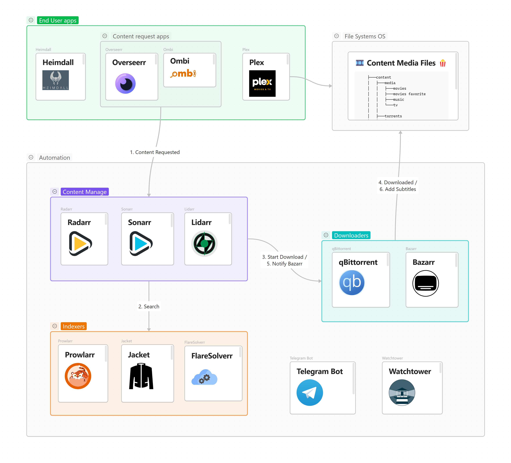

# Automated Home Media Server

This is a fully automated home media server setup using Docker Compose. It pulls content, organizes it, adds subtitles, and makes everything available through Plex with minimal manual input. The whole system can be controlled via a user-friendly web dashboard.

<!-- *Created 2023-01-16* Date started to develop and research-->
<!-- *Modified 2025-08-07* -->

[Read the full article - wiki.ayanev.eu, Automated home media server](https://wiki.ayanev.eu/#/do-it-yourself/2023-01-home-media-server/)

## Table of Contents

- [User Flow](#user-flow)
- [System Architecture](#system-architecture)
- [Deployment](#deployment)
- [Service Configuration](#service-configuration)
  - [Plex](#plex)
  - [Heimdall](#heimdall)
  - [qBittorrent](#qbittorrent)
  - [Prowlarr](#prowlarr)
  - [Jackett](#jackett)
  - [Radarr](#radarr)
  - [Sonarr](#sonarr)
  - [Lidarr](#lidarr)
  - [Bazarr](#bazarr)
  - [Ombi](#ombi)
- [References](#references)

## User Flow

1. A user requests a movie, show, or album via Ombi.
2. Ombi passes that request to Radarr (for movies), Sonarr (for shows), or Lidarr (for music).
3. These apps search indexers (through Prowlarr or Jackett) and send the torrent to qBittorrent.
4. qBittorrent downloads it. Once complete, the files are moved to the correct media folder.
5. Plex scans the folder and updates the library.
6. Bazarr fetches subtitles and stores them with the media files.
7. The user streams the content via Plex.

## System Architecture



Each component in this stack has one job:

- **Plex**: Media player and server.
- **Radarr**: Finds, downloads, and manages movies.
- **Sonarr**: Same as Radarr, but for TV.
- **Lidarr**: Same, but for music.
- **qBittorrent**: The download engine.
- **Jackett/Prowlarr**: Connects Radarr/Sonarr/Lidarr to torrent indexers.
- **Bazarr**: Automatically downloads subtitles.
- **Ombi/Overserr**: Frontend for users to request content.
- **Heimdall**: Centralized dashboard.

## Deployment

The project use the following folder structure: ``content`` and ``provision`` in the same directory as the compose file, this folder will be used to store your media files and persist service configurations.

```bash
.
│   docker-compose.yml
│   README.md
│
├───content
│   ├───media
│   │   ├───movies
│   │   ├───movies favorite
│   │   ├───music
│   │   └───tv
│   │
│   ├───torrents
│   │   ├───movies
│   │   └───tv
│   └───usenet
│       ├───movies
│       ├───music
│       └───tv
│
└───provision
```

Run `docker-compose up -d`.

How to add env variables (in case want to set watchover telegram notifications)

``` bash
export TELEGRAM_TOKEN=real_token_here
export TELEGRAM_CHAT_ID=real_chat_id
```

## Service Configuration

Setting up all the services correctly takes time and attention to detail. If this is your first time working with self-hosted apps, Docker, or media management tools, expect some trial and error. There’s no one-size-fits-all setup, but the following sections walk through the main configuration steps you’ll need.

Before continuing, be aware of your local laws regarding torrent usage and copyright. This setup is intended for managing your own media collection.

### Plex

- Access the Plex Web UI `http://<host>:32400/web`
- You will be prompted to sign in or create a new account.
- After signing in, you'll be prompted to add your media folders.
- Once you've added your media, Plex will begin analyzing your media files, and then it will be ready to use.
- Enable ``Scan my library automatically`` and ``Run a partial scan when changes are detected`` from ``Settings``>``Library`` tab
- Additional resources: [github.com/plexinc/pms-docker](https://github.com/plexinc/pms-docker)

### Heimdall

- Web UI available at ``http://<host>:80``
- Click on ``Add an application here`` and search for the application, for example ``Plex``
- Add the rest of the services from ``Application list`` then ``Add``, here is a table for all the applications

| Title        | URL                        |
|--------------|----------------------------|
| Plex         | `http://<host>:32400/web`  |
| qBittorrent  | `http://<host>:8080`       |
| Radarr       | `http://<host>:7878`       |
| Sonarr       | `http://<host>:8989`       |
| Lidarr       | `http://<host>:8686`       |
| Prowlarr     | `http://<host>:9696`       |
| Jackett      | `http://<host>:9117`       |
| Bazarr       | `http://<host>:6767`       |
| Ombi         | `http://<host>:3579`       |

- Last, you may want to change home page background from settings menu

### qBittorrent

Access the Qbittorrent web interface at ``http://<host>:8080`` to set up and configure your download client.

1. Change default credentials
   The default credentials for the qBittorrent service provided in the LinuxServer's image are as follows:
     - Username: admin
     - Password: adminadmin
  
   It's important to note that these are the default credentials and it's highly recommended that you change them as soon as possible. You can change the credentials by going to the qBittorrent Web UI, and then navigating to the ``Settings``>``WebUI`` tab, and then change the username and password fields.
   It's also a good practice to use unique and strong passwords for all your services and update them regularly to ensure the security of your media server.

2. Downloads options (used for category-based save paths)
   When logged in click he "gear icon" to open ``Options``.
   Under ``Downloads tab``, ``Saving Management section`` configure as follows:
    - ``Default Torrent Management Mode``: ``Automatic`` (This is required for category-based save paths to work)
    - ``When Torrent Category changed``: ``Relocate torrent``
    - ``When Default Save Path changed``: ``Relocate affected torrents``
    - ``When Category Save Path changed``: ``Relocate affected torrents``
    - ``Default Save Path``: ``/data/torrents``
    - Click ``Save`` at the bottom of the panel

3. Seed Limits (optional)
   Once again go to ``Options`` and under ``BitTorrent tab``, ``Seeding Limits``section configure your preference, more about the options described here: [Seeding limits demystified in qBittorrent](https://scribbleghost.net/2022/04/08/seeding-limits-demystified-in-qbittorrent/).
   For example, ``When seeding time reaches 1440min (24h)`` and ``When ratio reaches 1`` then ``Pause torrent`` (Dont worry when donwload is complate Radarr will copy files to another directory).
   Set it to pause/stop when share ratio is met. In Sonarr/Radarr, enable Complete Download Handler and Failed Download Handler and enable Remove on both.
   That way, when torrents are done they'll pause and then Sonarr/Radarr will remove them after they've imported.

4. Categories
   - Radarr
     In he WebUI in the left menu expand ``CATEGORIES`` and right click on All, Select ``Add category``.
     In the ``New Category`` windows configure as follows:
       - Category: ``radarr`` (this must correspond to the category that is later configured in radarr)
       - Save path: ``/data/torrents/movies``
       - Click ``Add``  
   - Sonarr
     Repeat the process for Sonarr
       - Category: ``sonarr``(this must correspond to the category that is later configured in sonarr download client, dafault is sonarr-tv but will use sonarr)
       - Save path ``/data/torrents/tv``
   - Lidarr
     Repeat the process
       - Category: ``lidarr``
       - Save path ``/data/torrents/music``

### Prowlarr

1. Credentials
   First time access Prowlarr WEB UI you will be prompted to create credentials.
2. Indexers
   The first thing to set up in Prowlarr is indexers.
   You will add each indexer individually to Prowlarr, done from sidebar ``Indexers`` tab.
   You may use priority when configure them.
3. Sync Profiles
   Uder ``Settings``>``Apps``, use the default profile "Standard"
4. Apps
   Where we will configure Prowlarr to connect your other apps such as Radarr and Sonarr.
   Navigate to ``Settings``>``Apps`` and  choose:
   - Radarr
     You will need API Key (retrieve it from Radarr WEB UI ``Settings``> ``General`` > ``Security``), save it later use
     Sync Level: Use the default, ``Add and Remove Only``
     Prowlarr Server: ``http://prowlarr:9696`` (using the container name, because of the defined network)
     Radarr Server: ``http://radarr:7878``
   - Sonarr
     Same steps as Radarr
     API Key
     Prowlarr Server: ``http://prowlarr:9696``
     Sonarr Server: ``http://sonarr:8989``
   - Lidarr
     Same steps
     API Key
     Prowlarr Server: ``http://prowlarr:9696``
     Lidarr Server: ``http://lidarr:8686``
5. Notifications (optional)
   Nice to have, using telegram bot as notifications.
   There is a lot of information how to create Telegram bot using "Bot Father"
   You will need to have a bot token and ChatId.
   When retrieve Chat ID, take a not that starts with symbol ``-``

Additional resources:

- [Prowlarr Quick Start Guide (Official docs)](https://wiki.servarr.com/prowlarr/quick-start-guide)
- [Prowlarr - A must have for easy automation! (YouTube)](https://www.youtube.com/watch?v=5deZNf2WhwI)
- [Prowlarr is the Jackett alternative you need (unraid-guides.com)](https://unraid-guides.com/2022/04/29/prowlarr-is-the-jackett-alternative-you-need/)
- [Connect Prowlarr to Radarr (quickbox.io)](https://quickbox.io/knowledge-base/v2/applications/prowlarr/connect-prowlarr-to-radarr/)

### Jackett

Optional, you may use only Prowlarr instead.

- Access the Jackett Web UI by navigating to ``http://<host>:9117`` in your browser.
- In the Jackett Web UI, click on the "Add indexer" button on the top right corner of the page.
- You will find a list of available indexers, you can add or configure indexers as you wish.

### Radarr

Radarr Web UI by navigating to ``http://<host>:7878`` in your browser.

1. Credentials
   Add credentials ``Settings``>``General``>``Security``
2. Download Clients
   Located in ``Settings``>``Download Clients`` tab, click on the "Add" button to add a new download client, select "qBittorrent" from the list
   Host: ``qbittorrent``, not IP or localhost
   Port: 8080 (default)
   Username and Password
   Category: radarr (should be fill as default)
   Test and Save buttons
3. Indexers (Optional)
   Nothing to do. Prowlarr should already seeded the indexers.
   If using Jackett:
      - In the "Indexers" tab, follow the instructions provided from Jackett page
      - For the URL input, use the container name ``jackett`` instead of IP or localhost or whatever you copy from the Jackett panel, for example ``http://jackett:9117/api/v2..``, do not forget to press the save button located on top.
4. Media Management
   Movie Naming
      - In the ``Media Management`` tab, you can configure how Radarr should organize and rename your downloaded movies.
      - Enable ``Rename Movies``
      - Naming pattern I found usefull, for example: ``({Release Year}) {Movie Title} {Quality Full}`` correspond to ``(2010) The Movie Title Bluray-1080p Proper``

   Enable ``Unmonitor Deleted Movies``
   Root Folders
      - ``/data/media/movies/``
      - ``/data/media/movies favorite/`` (Optional)
        Have a such folder where all my favorite movies to be in, so if i need to clean up space to inspect only the folder with the movies not in the favorites.
5. Notifications (Optional)
   Using Telegram, same as configuration described in Prowlarr
6. Analytics (Optional)
   You may want to turn of ``Send Anonymous Usage Data`` from ``Settings``>``General``>``Analytics``
7. Lists (Optional) **WIP!**
   Radarr Lists are custom collections of movies in the Radarr movie management software, used to keep track of and organize the movies in your collection.
   They can be customized and used with Radarr's "Lists and Indexers" feature for efficient movie management.
   Radarr Lists allow you to create custom lists of movies, such as "Want to Watch", "Watched", "Owned", and so on.
   This helps you keep track of which movies you have and which ones you still need to add to your collection.
   Allows you to search for movies from specific sources, such as IMDb, Trakt, or TMDB. By using Radarr Lists and Indexers together, you can easily find the movies you want to add to your collection and keep track of your progress.
8. Custom Formats (Optional)
   This could help us to search for example a movie that translated in out native language
   For example, prioritize BG Audio movies:
      - Click on ``Add Custom Format``, give it a name
      - Conditions:
        - Type: ``Release Title``, Name: ``BGAUDIO in tittle``, Regular Expression: ``BGAUDIO``
        - Type: ``Release Title``, Name: ``Bulgarian in tittle``, Regular Expression: ``Bulgarian``
        - Type: ``Language``, Name: ``BG audio source``, Language: ``Bulgarian``

Once you've finished configuring Radarr, you can start adding movies to your library by clicking on the "Add Movies" button on the top right corner of the page.
You can also set up Radarr to automatically search for new movies by clicking on the "Calendar" button on the sidebar of the page.

### Sonarr

Visit ``http://<host>:8989`` to set up your Sonarr and configure your TV shows library.
Sonarr configuration is straight forward, you may follow the guidelines from Radarr, in summary:

1. Credentials
2. Download Clients
   Host: ``qbittorrent``
   Category ``sonarr``, default is ``tv-sonarr``
3. Indexers (Optional)
   Prowlarr should already seeded the indexers.
4. Media Management
   Episode Naming
      - Season Folder Format: ``{Series Year} Season {season}``
   Enable ``Unmonitor Deleted Movies``
   Root Folders
      - ``/data/media/tv/``
5. Notifications (Optional)
   ``Settings``>``Connect``
6. Analytics (Optional)
   ``Send Anonymous Usage Data`` from ``Settings``>``General``>``Analytics``
7. Lists (Optional)

Once you've added your TV shows, Sonarr will begin searching for them, downloading them and adding them to your Plex library.

### Lidarr

Web interface available at ``http://<host>:8686``  
Configuration similar to Radarr and Sonarr, check them for reference.

### Bazarr

Access the Bazarr web interface by going to ``http://<host>:6767`` in a web browser.

1. Credentials
   ``Settings``>``General``>``Security`` and for the Authentication choose ``Form`` then ``Save`` changes
2. Analytics
   You may want to disable, ``Settings``>``General``>``Analytics``
3. Languages
   ``Settings``>``Languages``, next values are up to you, for example:
   Languages Filter: ``Bulgarian`` ``English``
   Languages Profiles: Name ``BG/EN``, choose the Languages
   Default Settings: Enable for Series and Movies
   Don't forget to ``Save`` before leaving the page
4. Use Sonarr and Radarr
   This will sync with apps
   An API key's will be needed
   You may also want to check the ``Minimum Score`` under ``Options`` section, leave it default, works fine.
5. Notifications (Optional)
   Same as other services
   ``tgram://{BotToken}/{ChatId}``
6. Providers
   Add providers, the most important part, for example:
   - OpenSubtitles.org
   - Subsunacs.net
   - Subs.sab.bz
   - Yavka.net
   - Supersubtitles
7. Scheduler
   - You may want to update some of the settigns such as ``Sonarr/Radarr Sync``

It's worth noting that the specifics of the setup may vary depending on your specific setup, but the above steps should give you a good starting point.
You can also refer to the official documentation of Bazarr for more information about the settings and options available.

- [wiki.bazarr.media/Getting-Started/Setup-Guide/](https://wiki.bazarr.media/Getting-Started/Setup-Guide/)
- [wiki.bazarr.media/Additional-Configuration/](https://wiki.bazarr.media/Additional-Configuration/Settings/)
- [wiki.bazarr.media/Troubleshooting/FAQ](https://wiki.bazarr.media/Troubleshooting/FAQ/#what-are-forced-subtitles)

### Ombi

Access the Ombi web interface by navigating to the URL ``http://<host>:3579`` in a web browser.

1. Follow the initial setup from Ombi, (``Welcome``>``Media Server``>``Create local admin``>``Ombi config``).
2. Connect Ombi to your media server(s) or download client(s), such as Plex, Sonarr, Radarr, etc.
   Sonarr
   Configuration located in ``Settings``>``Sonarr``, you will need API Key for Hostname: ``sonarr``.
   On the left press ``Load Qualities`` and choose default profile, same for ``Load Folders`` and ``Load Languages``.
   Radarr and Lidarr are configured in a similar way.
3. Notifications (Optional).
   Using Telegram, same as other services configuration.
4. Data collection (Optional).
   You may want to turn off ``Allow us to collect anonymous analytical data e.g. browser used`` from ``Configuration``>``General``.
5. Add Plex **WIP!**
   From ``Settings``>``Media Server``

Additional resources:

- [Ombi - Bytesized Hosting Wiki](https://bytesized-hosting.com/pages/ombi)

## References

- [Servarr Docs](https://wiki.servarr.com/docker-guide)
- [Flemmingss - Media Automation Guide](https://flemmingss.com/a-minimal-configuration-step-by-step-guide-to-media-automation-in-unraid-using-radarr-sonarr-prowlarr-jellyfin-jellyseerr-and-qbittorrent/)
- [Webreaper Compose Example](https://gist.github.com/Webreaper/81ecda3ecc45fa61a16dfc90cfc4550d)

This README focuses on practical setup steps with minimal fluff. If you need help or want to explore more customizations, check the full guide: [wiki.ayanev.eu](https://wiki.ayanev.eu/#/do-it-yourself/2023-01-home-media-server/)
